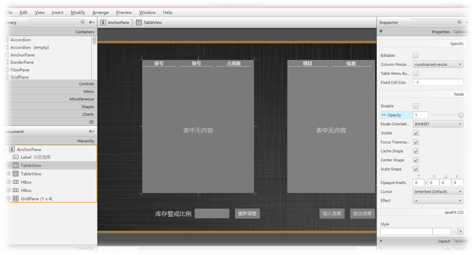
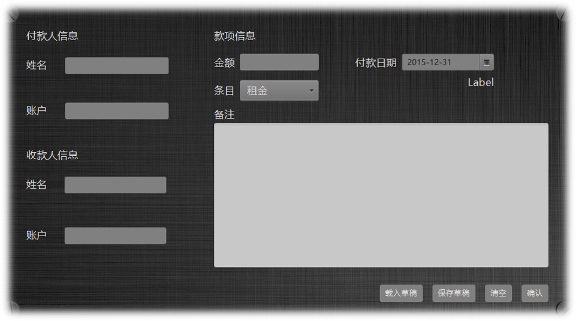
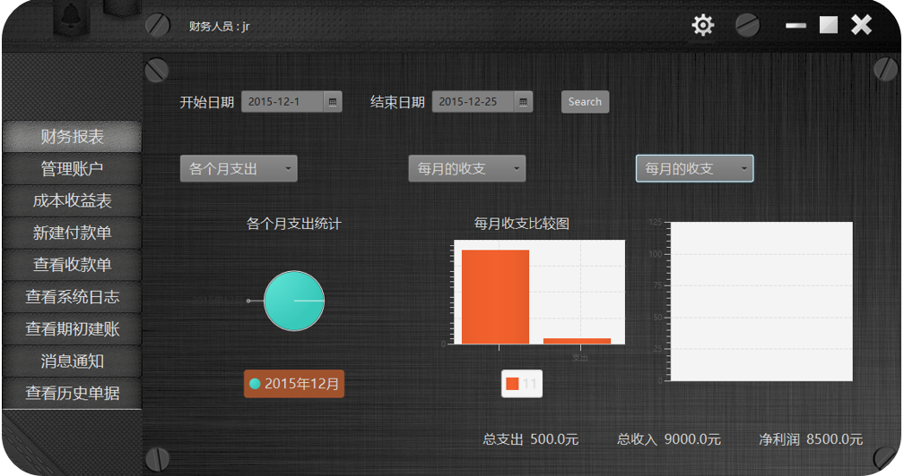
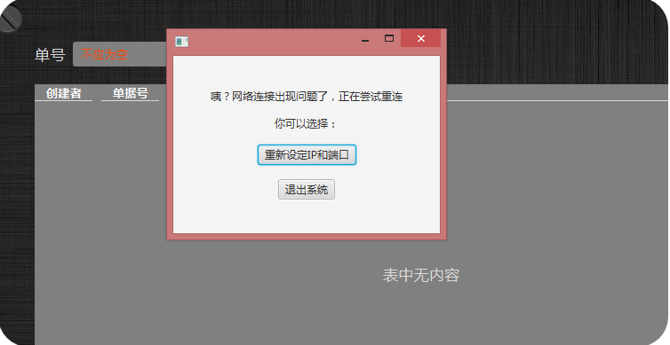
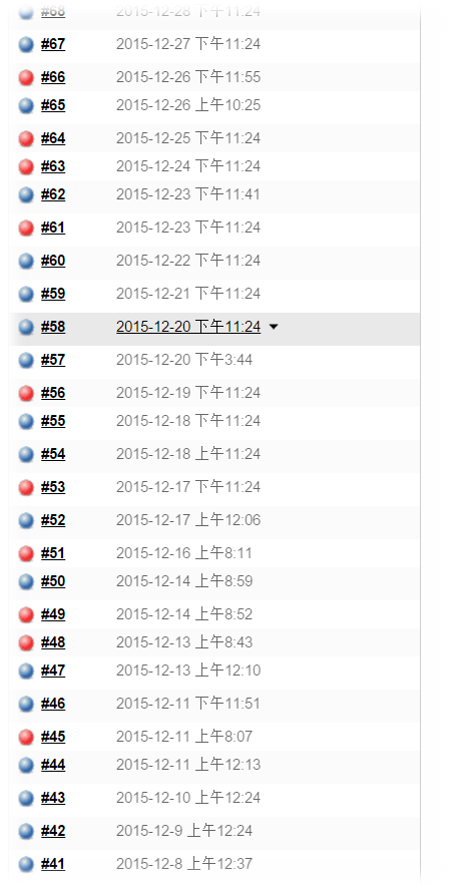
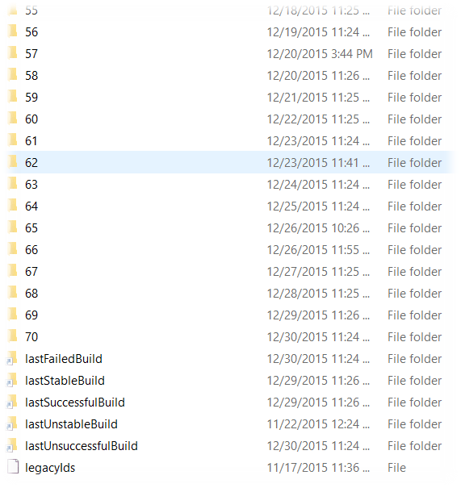

# 快递物流系统
这是南京大学软件学院2014级《软件工程与计算Ⅱ》的课程实践项目，项目以四人为组，采用标准的迭代式模型开发，并提供开发过程中所有文档、会议记录
# 项目背景
以简化后的快递物流行业为蓝图，要求系统支持快递员、业务员、经理、会计、系统管理员等超过10中角色同时使用系统，并支持响应的自动化操作。具体需求分析结果详见[需求规格说明文档](需求规格说明文档/需求规格说明文档.docx)
# 项目特色
## 详细、完整的文档说明与制品
采用标准的软件工程流程进行开发，进行详细的记录，符合行业标准
## 分层架构
四人协商进行架构设计，采用分层结构，C/S模式进行开发
## javafx技术
采用javafx代替传统的swing进行开发，使得界面保持美观、优雅的同时拥抱开放

图表显示新颖直观

## cache缓存
采用了缓存来解决数据加载慢的问题
## rmi通信
采用rmi进行通信，支持故障检测与重新连接

## 自动化构建与测试
采用jenkins进行自动化构建协助开发

# 更多
详细的项目介绍请[点击](2333.pptx)
